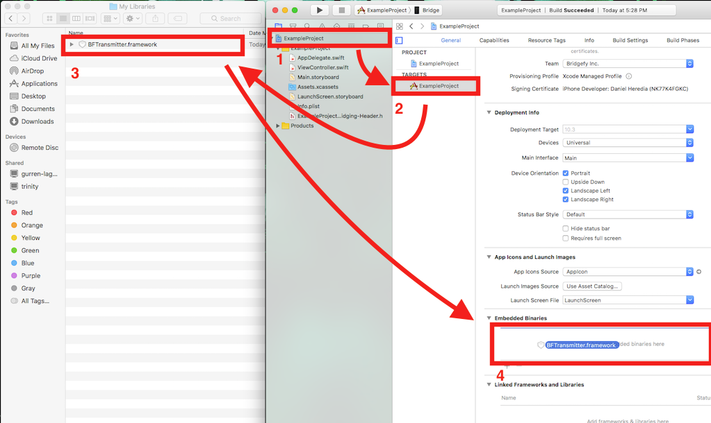
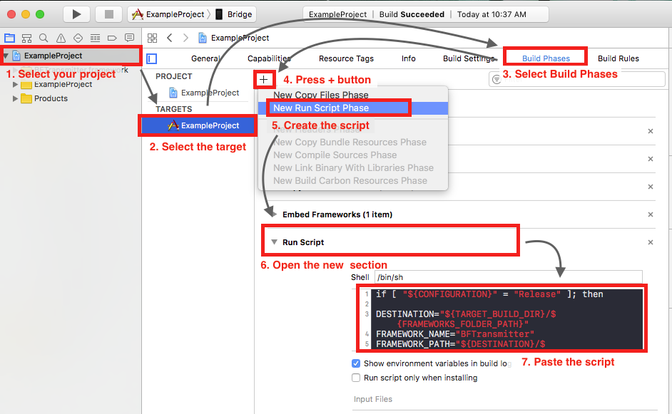

# Bridgefy Transmitter
Bridgefy Transmitter is a library that allows the client to transmit data to nearby peers without the necessity of an Internet connection or an access point. It also implements a mesh-network transmission algorithm that enables devices to send data to peers that are so far away that they aren't visible to the client device.

 **<span style="color:red">IMPORTANT NOTE</span>**
This repository doesn't containt the full version of the framework, in order to run the example projects, please go the [distribution repository][BRIDGEFY_DIST] to get the last official version of `BFTransmitter.framework` and replace the local copy. 

If you want to use the framework in your own projects, you will need to get the full version, too. If you decide to use CocoaPods to install the framework, you will already have the official version, so you can
If you found this without first having gone through the Bridgefy website, you probably don't have access to the framework repository, so the sample projects won't work. More information about the Bridgefy framework is available [here][BRIDGEFY_WEB]. If you already have access, just copy the file `BFTransmitter.framework` to the root directory of this repository.

---

## Pod setup

Podspec source repository:
```
https://bitbucket.org/bridgefy/bridgefypods
```

Framework repository:
```
https://bitbucket.org/bridgefy/bridgefy-ios-dist
```

Add the podspec source and pod's name (BFTransmitter) to your Podfile. If you haven't created a Podfile yet, it should look like this:

```
source 'https://github.com/CocoaPods/Specs.git'
source 'https://bitbucket.org/bridgefy/bridgefypods.git'

target 'YOUR_TARGET' do
  pod 'BFTransmitter'
end
```

Where `YOUR_TARGET` is the name of your project's target.

Setup the new source. This step is necessary so BFTransmitter can be added to the Pod list:

```bash
$ pod setup
```

And install the pod:

```bash
$ pod install
```
---

## Manual setup

Download the official version of `BFTransmitter.framework` [here][BRIDGEFY_DIST], open your project and drag the file and drop it in the "Embedded Binaries" section of your project as shown in the following picture:  
  
Select the option "Copy items if needed" and you will be able to use the framework.

### Swift projects
If you need to use the framework in a Swift project you will need to create a bridging header, this process is described [here][BRIDGING_HEADER]. An easy way to do it is just create an Objective-C class, then XCode will ask you to create the bridging header automatically, once created, delete the new class and edit the file `YOUR_PROJECT-Bridging-Header.h` to replace the content with `#import <BFTransmitter/BFTransmitter.h>`.

---

## Submit to the Appstore

In order to submit to the appstore, you will need to add the key `NSBluetoothPeripheralUsageDescription` to `Info.plist`, as value introduce a description of the use of Bluetooth in the app, this message will be shown to the user.

Additionally, if you made a **manual setup** (you **didn't** use CocoaPods), you will need to strip the architectures `i386` and `x86_64`, this because the framework is sent including this architectures, so you can run your apps in the simulator, but the Appstore doesn't accept them for distribution. You can do this adding the following Run Script to the phases of your target:

```sh
if [ "${CONFIGURATION}" = "Release" ]; then

DESTINATION="${TARGET_BUILD_DIR}/${FRAMEWORKS_FOLDER_PATH}"
FRAMEWORK_NAME="BFTransmitter"
FRAMEWORK_PATH="${DESTINATION}/${FRAMEWORK_NAME}.framework/${FRAMEWORK_NAME}"

lipo -remove i386 "$FRAMEWORK_PATH" -output "$FRAMEWORK_PATH"
lipo -remove x86_64 "$FRAMEWORK_PATH" -output "$FRAMEWORK_PATH"
echo "Fat library stripped: ${FRAMEWORK_PATH}"

fi
```

If you don't know how to add Run Scripts, you can check the following image:

  

---

## Basic usage

### 1. Instance
The following code shows how to create an instance of BFTransmitter (using your API key) and how to assign the delegate. This last action isn't mandatory but is necessary in order to be notified about connections and data reception:

```objective-c
//Objective-C
    BFTransmitter * transmitter = [[BFTransmitter alloc] initWithApiKey:@"YOUR API KEY"];
    //BFTransmitterDelegate protocol must be implemented.
    transmitter.delegate = self;
```
```swift
//Swift
    let transmitter = BFTransmitter(apiKey: "YOUR API KEY")
    //BFTransmitterDelegate protocol must be implemented.
    transmitter.delegate = self
```

The string "YOUR API KEY" represents a valid API key. This is necessary so the transmitter can be started. Internet connection is needed at least for the first time the transmitter is instantiated in order to validate the license.


### 2. Start transmitter
The transmitter can be started or stopped in order to use it only when necessary, and to optimize resources. The default state is stopped, and is activated this way:

```objective-c
//Objective-C
[transmitter start];
```
```swift
//Swift
transmitter.start()
```
The first time the transmitter is started, a session will be automatically created. This session contains a unique identifier for the current user, and some other data necessary for the encryption. The session management will be discussed further on in the section "Session".

To stop it, use the following code:

```objective-c
//Objective-C
[transmitter stop];
```
```swift
//Swift
transmitter.stop()
```
If something goes wrong during instantiation or start, the next methods will let you know the reason:

```objective-c
//Objective C
// Tipically this method is called when your license is expirated or no valid.
- (void)transmitter:(BFTransmitter *)transmitter didFailAtStartWithError:(NSError *)error;
// This is not necessarily an error, but let you know if the transmitter needs internet to validate the license.
- (void)transmitter:(BFTransmitter *)transmitter didOccurEvent:(BFEvent)event description:(NSString *)description;
```
```swift
//Swift
// Tipically this method is called when your license is expirated or no valid.
public func transmitter(_ transmitter: BFTransmitter, didFailAtStartWithError error: Error)
// This is not necessarily an error, but let you know if the transmitter needs internet to validate the license.
public func transmitter(_ transmitter: BFTransmitter, didOccur event: BFEvent, description: String)
```

### 3. Nearby peer detection
Detect peer connection:

When a peer is detected, the connection is made automatically. The following method is invoked when a peer has established connection:

```objective-c
//Objective C
- (void)transmitter:(BFTransmitter *)transmitter didDetectConnectionWithUser:(NSString *)userUser;
```
```swift
//Swift
public func transmitter(transmitter: BFTransmitter!, didDetectConnectionWithUser userUser: String!)
```
**transmitter**: Instance of BFTransmitter invoking the method.

**user**: Identifier for the user that has established a connection. Must be saved in order to send information to that user.

When a peer is disconnected (out of range), the following method will be invoked:

```objective-c
//Objective-C
- (void)transmitter:(BFTransmitter *)transmitter didDetectDisconnectionWithUser:(NSString *)userUser;
```
```swift
//Swift
public func transmitter(transmitter: BFTransmitter!, didDetectDisconnectionWithUser userUser: String!)
```
**transmitter**: Instance of BFTransmitter invoking the method.

**user**: Identifier of the disconnected user.

### 4. Send data
The following method is used to send data to another peer. This method performs an initial validation over the received parameters and if everything is correct, generates a packet identifier that is returned to the client. All of this initial process is synchronous. After this, the packet enters to an asynchronous process for the transmission of the packet.

```objective-c
//Objective-C
- (NSString * _Nullable)sendDictionary:(NSDictionary<NSString *, id> * _Nullable)dictionary
                              withData:(NSData * _Nullable)data
                                toUser:(NSString * _Nullable)user
                               options:(BFSendingOption)options
                                 error:(NSError *_Nullable*_Nullable)error;
```
```swift
//Swift
func sendDictionary(dictionary: [String, AnyObject]?,
                 withData data: NSData?,
                   toUser user: String?,
                       options: BFSendingOption,
                         error: NSError?) -> String?
```
 **dictionary**: NSDictionary object to be sent to the other user, it can be nil if data isn't.

 **data**: NSData object to be sent to the other user, it can be nil if dictionary isn't.

 **options**: Indicates the different options used to send the data.

 **error**: Reference to an NSError object, must be nil before the call to the method. If there's an error while sending the data, it will be assigned to it.

 ***returns***: If the transmission started successfully, it will contain a unique identifier for the packet; otherwise it will be nil.

The following example shows how to send a dictionary to another peer when it's in range and no encryption is required:

```objective-c
//Objective-C
    // Initialize with a serializable NSDictionary object.
    NSDictionary *payload = @{@"text" : @"Text message."};
    // Identifier received previously in the connection detection.
    // This one is just an example.
    NSString *receiverUser = @"6655a16c-8209-46c4-9c51-21d8df3efb95";
    NSError *error = nil;
    NSString *packetID = [transmitter sendDictionary:payload
                                            withData:nil
                                              toUser:receiverUser
                                             options: (BFSendingOptionNoEncrypted |
                                                       BFSendingOptionDirectTransmission)
                                               error: &error];
```
```swift
//Swift
    // Initialize with a serializable NSDictionary object.
    let payload = ["text" : "Text message."]
    // Identifier received previously in the connection detection.
    // This one is just an example.
    let user = "6655a16c-8209-46c4-9c51-21d8df3efb95"
    let options: BFSendingOption = [.NoEncrypted, .DirectTransmission]
    do {
        try transmitter.sendDictionary(payload,
                                       withData: nil,
                                       toUser: user,
                                       options: options)
    }
    catch let err as NSError
    {
        print("Error: \(err)")
    }
```

The options will be explained further on, but in this example the options indicate that the information won't be encrypted and the transmission must be performed only when the other peer is in range.

If the packet was sent successfully, the following method will be invoked:

```objective-c
//Objective-C
- (void)transmitter:(BFTransmitter *)transmitter didSendDirectPacket:(NSString *)packetID;
```
```swift
//Swift
public func transmitter(transmitter: BFTransmitter, didSendDirectPacket packetID: String)
```
**packetID**: Unique identifier assigned to the packet. It's the same as the one returned by sendDictionary:

Otherwise, if there was an error while sending, this method will be invoked:

```objective-c
//Objective-C
- (void)transmitter:(BFTransmitter *)transmitter didFailForPacket:(NSString *)packetID error:(NSError * _Nullable)error;
```
```swift
//Swift
public func transmitter(transmitter: BFTransmitter, didFailForPacket packetID: String, error: NSError?)
```
**transmitter**: Instance of BFTransmitter invoking the method.

**packetID**: Unique identifier assigned to the packet, it's the same as the one returned by sendDictionary:

**error**: Error related to the problem.

### 5. Receive Data
When a packet has been received, the following method will be invoked:

```objective-c
//Objective-C
- (void)transmitter:(BFTransmitter *)transmitter
        didReceiveDictionary:(NSDictionary<NSString *, id> * _Nullable) dictionary
                    withData:(NSData * _Nullable)data
                    fromUser:(NSString *)user
                    packetID:(NSString *)packetID
                   broadcast:(BOOL)broadcast
                        mesh:(BOOL)mesh;
```
```swift
//Swift
    public func transmitter(transmitter: BFTransmitter,
                            didReceiveDictionary dictionary: [String, AnyObject]?,
                            withData data: NSData?,
                            fromUser user: String,
                            packetID: String,
                            broadcast: Bool,
                            mesh: Bool)
```
**transmitter**: Instance of BFTransmitter invoking the method.

**dictionary**: Received dictionary object, can be nil if data isn't.

**data**: Received NSData object, can be nil if dictionary isn't.

**user**: Identifier related to the user who is sending the packet.

**packetID**: Unique identifier related to the packet.

**broadcast**: Indicates if the packet received was received via broadcast.

**mesh**: Indicates if the packet was received via mesh (will be explained further on).

---

## Secure connections

Optionally, a secure connection can be established. In a secure connection, encrypted content can be sent using RSA encryption.

One option to do it is by implementing the following method:

```objective-c
//Objective-C
- (BOOL)transmitter:(BFTransmitter *)transmitter shouldConnectSecurelyWithUser:(NSString *)user;
```
```swift
//Swift
optional public func transmitter(transmitter: BFTransmitter, shouldConnectSecurelyWithUser user: String) -> Bool
```
**transmitter**: Instance of BFTransmitter invoking the method.

***return***: YES to establish a secure connection, NO otherwise.

This method is called when a connection is just created and the returned value is used to know if the process should keep creating a secure connection.

The other option to establish a secure connection is invoking the following method:

```objective-c
//Objective-C
- (void)establishSecureConnection:(NSString *)user
                            error:(NSError *_Nullable*_Nullable)error;
```
```swift
//Swift
public func establishSecureConnection(user: String,
                                      error: NSError?)
```
**user**: Identifier of the user.

**error**: Will be assigned if an error happens.

In both ways the following delegate method will be invoked to indicate that the secure connection was successful:

```objective-c
//Objective-C
- (void)transmitter:(BFTransmitter *)transmitter didDetectSecureConnectionWithUser:(NSString *)userUser;
```
```swift
//Swift
optional public func transmitter(transmitter: BFTransmitter, didDetectSecureConnectionWithUser user: String)
```
**transmitter**: Instance of BFTransmitter invoking the method.

**user**: Identifier of the user.

The possibility to send encrypted content remains even after the other user has gone out of range (e.g. sending an encrypted mesh packet), but it depends on the secure connection expiration. Expiration is the amount of time that a connection keeps existing even without activity. When a secure connection expires, encrypted content cannot be sent to the receiver until a new secure connection is established again. For this purpose, "activity" is when the user is in range, or encrypted content is sent even when the user is out of range.

The expiration limit is the same for all the connections and can be checked or set up using the following methods:

```objective-c
//Objective-C
  //Get the expiration
  - (NSInteger)secureConnectionExpirationLimit;
  //Set the expiration
  - (void)setSecureConnectionExpirationLimit:(NSInteger)limit;
```
```swift
//Swift
  //Get the expiration
  - (NSInteger)secureConnectionExpirationLimit;
  //Set the expiration
  - (void)setSecureConnectionExpirationLimit:(NSInteger)limit;
```

---

## Direct and mesh transmission

* **Direct transmission** is a mechanism used to deliver packets to a user that is nearby or visible (a connection has been detected).

* **Mesh transmission** is a mechanism used to deliver offline packets even when the receiving user is not nearby or visible. It can be achieved taking advantage of other nearby peers; these receive the package, hold it, and forward to other peers trying to find the receiver.

A message can be transmitted using mesh transmission, direct transmission, or both. The options used to achieve this will be discussed in the following section.

---

## Sending options

There are several options for sending packets:

- **BFSendingOptionDirectTransmission**: Sends the packet only when the receiver is in range.
- **BFSendingOptionMeshTransmission**: Sends the packet using mesh. it doesn't need the receiver to be in range.
- **BFSendingOptionFullTransmission**: Tries to send the packet if the peer is in range, otherwise includes the packet in the mesh process.
- **BFSendingOptionEncrypted**:  Sends the packet encrypted. It can cause an error if a secure connection has not been established at least once.
- **BFSendingOptionNoEncrypted**: Sends the packet without encryption.
- **BFSendingOptionBroadcastReceiver**: Sends a packet using mesh without a defined receiver. The packet is broadcast to all nearby users that are or aren't in range. If this option is used and encryption option is added, it will cause an error.

Some examples:

Sending a dictionary packet with encryption to another user via mesh:

```objective-c
//Objective-C
    NSDictionary *payload = @{@"text" : @"Text message."};
    NSString *receiverUser = @"6655a16c-8209-46c4-9c51-21d8df3efb95";
    [transmitter sendDictionary:payload
                       withData:nil
                         toUser:receiverUser
                        options: (BFSendingOptionEncrypted | BFSendingOptionMeshTransmission)
                          error: &error];
```
```swift
//Swift
    let payload = ["text" : "Text message."]
    let user = "6655a16c-8209-46c4-9c51-21d8df3efb95"
    let options: BFSendingOption = [.Encrypted, .MeshTransmission]
    try transmitter.sendDictionary(payload,
                                    withData: nil,
                                    toUser: user,
                                    options: options)
```

Sending a dictionary with encryption to another user, but just if the other user is near:

```objective-c
//Objective-C
    NSDictionary *payload = @{@"text" : @"Text message."};
    NSString *receiverUser = @"6655a16c-8209-46c4-9c51-21d8df3efb95";
    [transmitter sendDictionary:payload
                       withData:nil
                         toUser:receiverUser
                        options: (BFSendingOptionEncrypted | BFSendingOptionDirectTransmission)
                          error: &error];
```
```swift
//Swift
    let payload = ["text" : "Text message."]
    let user = "6655a16c-8209-46c4-9c51-21d8df3efb95"
    let options: BFSendingOption =  [.Encrypted, .DirectTransmission]
    try transmitter.sendDictionary(payload,
                                    withData: nil,
                                    toUser: user,
                                    options: options)
```

Sending a dictionary with encryption to another user, first using direct transmission, and if it fails, then using mesh:

```objective-c
//Objective-C
    NSDictionary *payload = @{@"text" : @"Text message."};
    NSString *receiverUser = @"6655a16c-8209-46c4-9c51-21d8df3efb95";
    [transmitter sendDictionary:payload
                       withData:nil
                         toUser:receiverUser
                        options: (BFSendingOptionEncrypted | BFSendingOptionFullTransmission)
                          error: &error];
```
```swift
//Swift
    let payload = ["text" : "Text message."]
    let user = "6655a16c-8209-46c4-9c51-21d8df3efb95"
    let options: BFSendingOption = [.Encrypted, .FullTransmission]
    try transmitter.sendDictionary(payload,
                                    withData: nil,
                                    toUser: user,
                                    options: options)
```

Sending a dictionary without encryption to another user using just mesh:

```objective-c
//Objective-C
    NSDictionary *payload = @{@"text" : @"Text message."};
    NSString *receiverUser = @"6655a16c-8209-46c4-9c51-21d8df3efb95";
    [transmitter sendDictionary:payload
                       withData:nil
                         toUser:receiverUser
                        options: (BFSendingOptionNoEncrypted | BFSendingOptionMeshTransmission)
                          error: &error];
```
```swift
//Swift
    let payload = ["text" : "Text message."]
    let user = "6655a16c-8209-46c4-9c51-21d8df3efb95"
    let options: BFSendingOption = [.NoEncrypted, .MeshTransmission]
    try transmitter.sendDictionary(payload,
                                    withData: nil,
                                    toUser: user,
                                    options: options)
```

Sending a dictionary with broadcast option (to all nearby users):

```objective-c
//Objective-C
    NSDictionary *payload = @{@"text" : @"Text message."};
    [transmitter sendDictionary:payload
                       withData:nil
                         toUser:nil
                        options: (BFSendingOptionBroadcastReceiver)
                          error: &error];
```
```swift
//Swift
    let payload = ["text" : "Text message."]
    let options: BFSendingOption = [.BroadcastReceiver]
    try transmitter.sendDictionary(payload,
                                    withData: nil,
                                    toUser: nil,
                                    options: options)
```

There are some configurations for sending packets that won't work, like trying to send a broadcast packet (`BFSendingOptionBroadcastReceiver`) encrypted (`BFSendingOptionEncrypted`) or trying to send a broadcast packet  (`BFSendingOptionBroadcastReceiver`) with binary content.

---

## Session

A session is necessary in order for the BFTransmitter instance to work. The session is persistent in the device (even after the user deletes the app) and contains a key pair necessary for encryption and a unique identifier assigned to the device. These credentials are the same for all the BFtransmitter instances and won't expire by themselves. If the client needs to create a new session for another user or simply needs to close the session, this must be destroyed explicitly.

This code shows how to validate if there is an existing session:

```objective-c
//Objective-C
    if ([transmitter hasSession])
    {
        // The session exists
    }
```
```swift
//Swift
    if (transmitter.hasSession)
    {
        // The session exists
    }
```

And this code shows how to destroy a session:

```objective-c
//Objective-C
    [transmitter destroySession];
```
```swift
//Swift
    transmitter.destroySession()
```

---

## Background mode

The framework is able to preserve active connections when the app is sent to background. To enable this characteristic you will need to set the property `backgroundModeEnabled` of the `BFTransmitter` to YES (the default value is NO).

```objective-c
//Objective-C
    transmitter.backgroundModeEnabled = YES;
```
```swift
//Swift
    transmitter.backgroundModeEnabled = true
```

In order to enable, background mode, you will need to add the`UIBackgroundModes`key to your `Info.plist` file and set the keys value to an array containing one of the strings `bluetooth-peripheral` and `bluetooth-central`. If these keys are not added, the framework will launch an error.

---

## Log levels

The framework has four log levels that can be found in the following enumeration:

```objective-c
//Objective-C
    typedef NS_ENUM(NSUInteger, BFLogLevel) {
        BFLogLevelError = 0,
        BFLogLevelInfo,
        BFLogLevelDebug,
        BFLogLevelTrace
    };
```
```swift
//Swift
    public enum BFLogLevel : UInt {
        case Error
        case Info
        case Debug
        case Trace
    }
```

**error**: Prints just errors.

**info**: Prints errors and information related to the framework processes.

**debug**: Prints error, framework processes information and debug messages.

**trace**: Acts like the previous level, but also prints a full trace information for the mesh packets and some other specific events.

The default log level is `Error` and it can be changed using the following code (`Trace` will be used as an example):

```objective-c
//Objective-C
    [BFTransmitter setLogLevel:BFLogLevelTrace]
```
```swift
//Swift
    BFTransmitter.setLogLevel(BFLogLevel.Trace)
```
---

## Export and import keys

Encrypted content can only be sent when a secure connection with the receiver has been established at least once. This is because the public keys are needed to be exchanged during the handshake. There is a manual way to do it, by exporting and importing the keys manually, so a third party (like a web server) can distribute the keys to the required users.

Export the public key of the current device:

```objective-c
//Objective-C
+(NSString *)localPublicKey;
```
```swift
//Swift
public class func localPublicKey() -> String!
```
***returns***: The key for the local user encoded in base64.

Import a public key

```objective-c
//Objective-C
- (void)savePublicKey:(NSString *)key forUser:(NSString *)user;
```
```swift
//Swift
public func savePublicKey(key: String!, forUser user: String!)
```
**key**: The public key of the other user encoded in base64 as it was exported.

**user**: Identifier of the other user.

Once the key has been imported, the user can send encrypted content to a receiver even if it's not in range.

The following method shows if a key for a user with a certain identifier already exists:

```objective-c
//Objective-C
- (BOOL)existsKeyForUser:(NSString *)user;
```
```swift
//Swift
public class func existsKeyForUser(user: String!) -> Bool
```
**user**: Identifier of the user.

---

## Other information

### iOS Simulator

The framework is not currently supported on the iOS Simulator. The framework includes desktop architectures, so the examples or the framework integrated in your project will compile, but the BFTransmitter instance would not be started.

### Save state

If the app is closed and the BFTransmitter instance is not stopped before, `saveState:` method cleans and saves some control data (cache). The use is not mandatory, but is recommended stop the transmitter or call this method before the app is closed.

[ADD_KEY]: https://confluence.atlassian.com/bitbucket/set-up-ssh-for-git-728138079.html
[BRIDGEFY_WEB]: https://bridgefy.me/download-bridgefy.php
[BRIDGEFY_DIST]: https://bitbucket.org/bridgefy/bridgefy-ios-dist/
[BRIDGING_HEADER]: https://developer.apple.com/library/content/documentation/Swift/Conceptual/BuildingCocoaApps/MixandMatch.html
